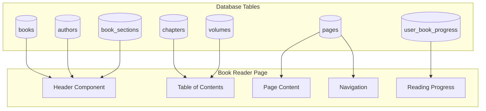

# Dynamic Book Reader Implementation Plan

## Overview

Convert the static `book-preview.blade.php` page to a fully dynamic book reader that loads real data from the database.

---

## How the Database Supports the Book Reader

Based on [database_schema_analysis.md](./database_schema_analysis.md), here's how data flows:



---

## Data Requirements per Component

### 1. Header Component
**Tables Used:** `books`, `authors`, `book_sections`

```php
$book = Book::with([
    'authors' => fn($q) => $q->orderByPivot('display_order'),
    'bookSection.parent'  // For breadcrumbs
])->findOrFail($bookId);
```

**Display:**
- Book title: `$book->title`
- Author(s): `$book->authors->first()->full_name`
- Breadcrumbs: Section → Parent Section → Book Title

---

### 2. Table of Contents (TOC)
**Tables Used:** `chapters`, `volumes`

```php
// If book has volumes
$volumes = Volume::where('book_id', $bookId)
    ->with(['chapters' => fn($q) => $q->whereNull('parent_id')
        ->orderBy('order')
        ->with('children')])
    ->orderBy('number')
    ->get();

// If no volumes, just chapters
$chapters = Chapter::where('book_id', $bookId)
    ->whereNull('parent_id')
    ->orderBy('order')
    ->with('allChildren')
    ->get();
```

**Display:**
- Hierarchical list of volumes/chapters
- Page numbers: `$chapter->page_start`
- Expandable nested chapters via `$chapter->children`

---

### 3. Page Content
**Tables Used:** `pages`

```php
$currentPage = Page::where('book_id', $bookId)
    ->where('page_number', $pageNumber)
    ->with(['chapter', 'volume'])
    ->first();
```

**Display:**
- Content: `$currentPage->html_content ?? $currentPage->content`
- Chapter title: `$currentPage->chapter?->title`
- Volume info: `$currentPage->volume?->title`

---

### 4. Navigation
**Tables Used:** `pages`

```php
$totalPages = Page::where('book_id', $bookId)->count();
$prevPage = Page::where('book_id', $bookId)
    ->where('page_number', '<', $pageNumber)
    ->orderByDesc('page_number')
    ->first();
$nextPage = Page::where('book_id', $bookId)
    ->where('page_number', '>', $pageNumber)
    ->orderBy('page_number')
    ->first();
```

---

### 5. Reading Progress (Optional)
**Tables Used:** `user_book_progress`

```php
// Save progress
UserBookProgress::updateOrCreate(
    ['user_id' => auth()->id(), 'book_id' => $bookId],
    ['last_page' => $pageNumber, 'last_read_at' => now()]
);
```

---

## Implementation Approach

### Option A: Livewire (Recommended)
**Pros:** SPA-like experience, no page reloads, reactive components
**Effort:** Migrate from BMS_v1 (~3-4 hours)

### Option B: Blade + AJAX
**Pros:** Simpler, less dependencies
**Effort:** Build from scratch (~6-8 hours)

---

## Files to Create/Modify

| Action | File | Purpose |
|--------|------|---------|
| **NEW** | `app/Livewire/BookReader.php` | Main Livewire component |
| **NEW** | `resources/views/livewire/book-reader.blade.php` | Reader view |
| **MODIFY** | `routes/web.php` | Add dynamic route |
| **MODIFY** | `app/Models/Volume.php` | Add `topLevelChapters` relationship |
| **DELETE** | Static components in `components/book/` | Replace with dynamic |

---

## Route Configuration

```php
// routes/web.php
use App\Livewire\BookReader;

Route::get('/book/{bookId}/{pageNumber?}', BookReader::class)
    ->name('book.read')
    ->where(['bookId' => '[0-9]+', 'pageNumber' => '[0-9]+']);
```

---

## Features Checklist

- [ ] Dynamic book header with title/author
- [ ] Breadcrumb navigation (Section → Book)
- [ ] Hierarchical Table of Contents
- [ ] Page content display (HTML + plain text)
- [ ] Previous/Next page navigation
- [ ] Direct page jump (input field)
- [ ] Progress bar
- [ ] Volume switcher (for multi-volume books)
- [ ] In-book search
- [ ] Font size controls
- [ ] Arabic diacritics toggle (حركات)
- [ ] Mobile responsive design
- [ ] Save reading progress (authenticated users)

---

## Database Notes

> [!IMPORTANT]
> **Current schema supports all features except:**
> - `books.status` field (for published/draft) - *optional*
> - `books.source_url` field (for external links) - *optional*

> [!TIP]
> **Recommended indexes for performance:**
> ```sql
> CREATE INDEX idx_pages_book_page ON pages(book_id, page_number);
> CREATE INDEX idx_chapters_book_parent ON chapters(book_id, parent_id);
> ```

---

## Next Steps

1. ✅ Database schema analyzed
2. ⏳ Create Livewire BookReader component
3. ⏳ Add route configuration
4. ⏳ Create reader view with components
5. ⏳ Test with real book data
6. ⏳ Add mobile responsive styles
