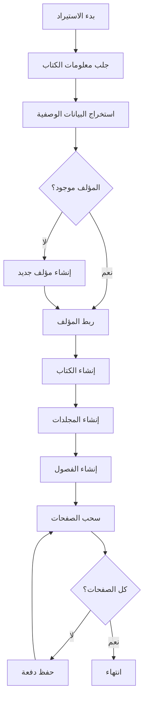

# 🚀 خطة دمج سكربت سحب الكتب مع قاعدة البيانات

**تاريخ الإنشاء:** 2026-01-18  
**الحالة:** قيد التخطيط

---

## 📋 ملخص التحليل

### الملفات الموجودة

| الملف | الوصف | الحالة |
|------|-------|-------|
| [`turath_scraper_discussion.md`](file:///c:/Users/osaid/Documents/BMS_alkamelah/doc/scraper/turath_scraper_discussion.md) | سكربت Node.js كامل لسحب الكتب من Turath.io | ✅ جاهز |
| [`turath_api_features.md`](file:///c:/Users/osaid/Documents/BMS_alkamelah/doc/scraper/turath_api_features.md) | ميزات إضافية مكتشفة من API | ✅ جاهز |
| [`DATABASE_STRUCTURE_GUIDE.md`](file:///c:/Users/osaid/Documents/BMS_alkamelah/doc/dataBase/DATABASE_STRUCTURE_GUIDE.md) | دليل بنية قاعدة البيانات | ⚠️ فارغ - يحتاج إنشاء |

---

## 🎯 رأيي في الملفات الحالية

### ✅ نقاط القوة

1. **سكربت Turath.io متكامل:**
   - تحليل شامل للـ API
   - معالجة أخطاء ممتازة (Retry Logic مع Exponential Backoff)
   - تأخير زمني مناسب (500ms) لتجنب الحظر
   - دعم استخراج: المحتوى، الفهرس، بيانات المؤلف، المحقق

2. **ميزات متقدمة مكتشفة:**
   - `volume_bounds`: معرفة عدد الصفحات بالضبط
   - `headings`: فهرس الكتاب الكامل
   - `meta.info`: معلومات المؤلف والمحقق

3. **كود نظيف وموثق:**
   - تعليقات واضحة بالعربي
   - بنية معمارية منظمة
   - قابل للتخصيص

### ⚠️ نقاط تحتاج تحسين

1. **السكربت يحفظ في ملفات TXT فقط:**
   - ❌ لا يدخل البيانات مباشرة في قاعدة البيانات
   - ❌ لا يستفيد من بنية Laravel/Eloquent

2. **لا يوجد ربط مع النماذج:**
   - ❌ لا توجد آلية لإنشاء `Book`, `Author`, `Chapter`, `Page`
   - ❌ لا يستخدم العلاقات بين الجداول

3. **ملف DATABASE_STRUCTURE_GUIDE.md فارغ:**
   - ❌ لا يوجد توثيق للجداول والعلاقات

---

## 📊 البيانات المتاحة من Turath.io API

### 1. معلومات الكتاب (`/book?id={id}&include=indexes`)

```json
{
  "meta": {
    "id": 147927,
    "name": "اسم الكتاب",
    "type": 5,
    "printed": 3,
    "info": "الكتاب: ...\\nالمؤلف: ...\\nالمحقق: ...\\nعدد الصفحات: ٦٧",
    "author_id": 44,
    "cat_id": "6"
  },
  "indexes": {
    "volumes": ["1", "2"],
    "headings": [
      { "title": "عنوان الفصل", "level": 1, "page": 5 }
    ],
    "volume_bounds": {
      "1": [1, 300],
      "2": [301, 600]
    }
  }
}
```

### 2. محتوى الصفحة (`/page?book_id={id}&pg={page}`)

```json
{
  "text": "محتوى الصفحة...",
  "page": 1
}
```

---

## 🔗 المطابقة مع قاعدة البيانات

### جدول المطابقة

| بيانات Turath.io | جدول قاعدة البيانات | الحقول |
|-----------------|-------------------|--------|
| `meta.id` | `books` | `shamela_id` (يمكن استخدامه كمعرف خارجي) |
| `meta.name` | `books` | `title` |
| `meta.info` (parsed) | `books` + `authors` + `publishers` | بيانات متفرقة |
| `meta.cat_id` | `book_sections` | `id` (يحتاج mapping) |
| `indexes.volumes` | `volumes` | `number` |
| `indexes.volume_bounds` | `volumes` | `page_start`, `page_end` |
| `indexes.headings` | `chapters` | `title`, `level`, `page_start` |
| `page.text` | `pages` | `content` |

---

## 📝 خطة العمل المقترحة

### المرحلة 1: إعداد البنية الأساسية 🔧

**المدة:** يوم واحد

#### 1.1 إنشاء ملف دليل قاعدة البيانات

- [ ] ملء ملف `DATABASE_STRUCTURE_GUIDE.md` بتفاصيل الجداول
- [ ] توثيق العلاقات بين الجداول
- [ ] إضافة أمثلة على الـ Queries

#### 1.2 إنشاء مجلد السكربتات

```
app/
├── Console/
│   └── Commands/
│       └── ImportTurathBook.php    ← أمر Artisan
├── Services/
│   └── TurathScraperService.php    ← خدمة السحب
```

---

### المرحلة 2: تطوير سكربت Laravel 🛠️

**المدة:** 2-3 أيام

#### 2.1 إنشاء Service Class

```php
// app/Services/TurathScraperService.php

class TurathScraperService
{
    protected $httpClient;
    protected $baseUrl = 'https://api.turath.io';
    protected $delay = 500; // ms
    
    public function getBookInfo(int $bookId): array { }
    public function getPageContent(int $bookId, int $pageNumber): ?string { }
    public function importBook(int $turathBookId): Book { }
}
```

#### 2.2 إنشاء Artisan Command

```php
// app/Console/Commands/ImportTurathBook.php

class ImportTurathBook extends Command
{
    protected $signature = 'turath:import {book_id}';
    protected $description = 'استيراد كتاب من Turath.io';
    
    public function handle(TurathScraperService $scraper) { }
}
```

#### 2.3 الميزات المطلوبة

| الميزة | الأولوية | الحالة |
|-------|---------|-------|
| جلب معلومات الكتاب وحفظها | 🔴 عالية | ⏳ |
| استخراج المؤلف وربطه | 🔴 عالية | ⏳ |
| إنشاء المجلدات | 🟡 متوسطة | ⏳ |
| إنشاء الفصول من `headings` | 🟡 متوسطة | ⏳ |
| سحب وحفظ الصفحات (Batch) | 🔴 عالية | ⏳ |
| شريط تقدم | 🟢 منخفضة | ⏳ |
| استئناف التحميل | 🟢 منخفضة | ⏳ |

---

### المرحلة 3: معالجة البيانات 🔄

**المدة:** يوم واحد

#### 3.1 استخراج البيانات من `meta.info`

```php
class MetadataParser
{
    public function parse(string $info): array
    {
        return [
            'book_name' => $this->extractField($info, 'الكتاب'),
            'author_name' => $this->extractField($info, 'المؤلف'),
            'editor_name' => $this->extractField($info, 'المحقق'),
            'reviewer_name' => $this->extractField($info, 'راجعها'),
            'pages_count' => $this->extractArabicNumber($info, 'عدد الصفحات'),
        ];
    }
}
```

#### 3.2 مطابقة الأقسام (Category Mapping)

```php
// Mapping من cat_id في Turath إلى book_section_id في قاعدتنا
$categoryMapping = [
    '1' => 5,  // العقيدة
    '2' => 10, // الفقه
    '6' => 3,  // الحديث
    // ...
];
```

#### 3.3 البحث عن المؤلفين الموجودين

```php
// البحث عن مؤلف موجود أو إنشاء جديد
$author = Author::firstOrCreate(
    ['full_name' => $extractedAuthorName],
    [
        'is_living' => false,
        // ... بيانات أخرى
    ]
);
```

---

### المرحلة 4: حفظ البيانات 💾

**المدة:** يوم واحد

#### 4.1 تدفق الحفظ



#### 4.2 حفظ الصفحات بالدفعات (Batch Insert)

```php
// حفظ 500 صفحة دفعة واحدة
$pages = [];
foreach ($pagesData as $pageData) {
    $pages[] = [
        'book_id' => $book->id,
        'volume_id' => $volumeId,
        'page_number' => $pageData['page'],
        'content' => $pageData['text'],
        'created_at' => now(),
        'updated_at' => now(),
    ];
    
    if (count($pages) >= 500) {
        Page::insert($pages);
        $pages = [];
    }
}

// حفظ الباقي
if (!empty($pages)) {
    Page::insert($pages);
}
```

---

### المرحلة 5: الاختبار والتوثيق ✅

**المدة:** يوم واحد

#### 5.1 اختبار السكربت

```bash
# اختبار على كتاب صغير (الأربعون النووية)
php artisan turath:import 147927

# اختبار على كتاب متوسط
php artisan turath:import 12345

# اختبار على كتاب كبير (صحيح البخاري)
php artisan turath:import 99999
```

#### 5.2 توثيق الاستخدام

```markdown
## استخدام السكربت

### الاستيراد الأساسي
php artisan turath:import {book_id}

### خيارات إضافية
php artisan turath:import {book_id} --dry-run     # معاينة بدون حفظ
php artisan turath:import {book_id} --skip-pages  # استيراد بدون صفحات
php artisan turath:import {book_id} --force       # إعادة الاستيراد
```

---

## 📁 هيكل الملفات المقترح

```
app/
├── Console/
│   └── Commands/
│       ├── ImportTurathBook.php         ← أمر الاستيراد
│       └── ImportTurathBooksFromList.php ← استيراد قائمة كتب
├── Services/
│   ├── TurathScraperService.php         ← خدمة السحب الرئيسية
│   └── MetadataParserService.php        ← تحليل البيانات الوصفية
└── Jobs/
    └── ImportTurathBookJob.php          ← للمعالجة في الخلفية

doc/
├── dataBase/
│   └── DATABASE_STRUCTURE_GUIDE.md      ← دليل قاعدة البيانات
└── scraper/
    ├── turath_scraper_discussion.md     ← (موجود)
    ├── turath_api_features.md           ← (موجود)
    └── SCRAPER_INTEGRATION_PLAN.md      ← هذا الملف
```

---

## ⏱️ الجدول الزمني

| المرحلة | المدة | تاريخ البدء | تاريخ الانتهاء |
|--------|------|------------|---------------|
| المرحلة 1: البنية الأساسية | 1 يوم | - | - |
| المرحلة 2: تطوير السكربت | 3 أيام | - | - |
| المرحلة 3: معالجة البيانات | 1 يوم | - | - |
| المرحلة 4: حفظ البيانات | 1 يوم | - | - |
| المرحلة 5: الاختبار | 1 يوم | - | - |
| **الإجمالي** | **7 أيام** | - | - |

---

## 🎯 الأولويات

### الآن (فوري) 🔴

1. ملء ملف `DATABASE_STRUCTURE_GUIDE.md`
2. إنشاء `TurathScraperService.php`
3. إنشاء أمر Artisan الأساسي

### قريباً (هذا الأسبوع) 🟡

1. معالجة البيانات الوصفية
2. ربط المؤلفين والأقسام
3. سحب وحفظ الصفحات

### لاحقاً (الأسبوع القادم) 🟢

1. شريط التقدم المتقدم
2. استئناف التحميل
3. المعالجة في الخلفية (Queue Jobs)

---

## ✅ الخطوة التالية

1. **الموافقة على هذه الخطة**
2. **تحديد الأولوية:** هل نبدأ بـ:
   - إنشاء ملف دليل قاعدة البيانات؟
   - إنشاء سكربت Laravel مباشرة؟
   - تحويل السكربت Node.js الحالي؟

---

**تم إعداد هذه الخطة بتاريخ:** 2026-01-18
