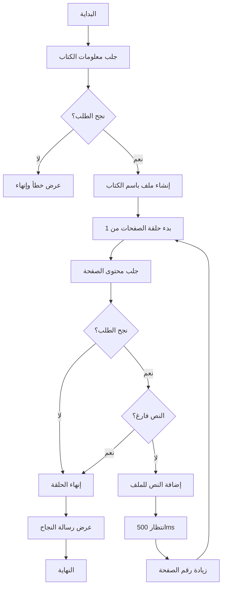

# سكريبت سحب محتوى كتاب من Turath.io

## نظرة عامة

هذا المستند يحتوي على تحليل شامل وكود كامل لسكريبت Node.js لسحب محتوى الكتب من موقع Turath.io باستخدام الـ API الداخلية المكتشفة.

---

## 📋 المتطلبات التقنية

### البيئة المطلوبة

- **Node.js**: الإصدار 14 أو أحدث
- **المكتبات المطلوبة**:
  - `axios`: للتعامل مع HTTP requests
  - `fs/promises`: للتعامل مع الملفات (مدمجة في Node.js)

### تثبيت المكتبات

```bash
npm init -y
npm install axios
```

---

## 🔍 تحليل الـ API

### 1. Endpoint معلومات الكتاب

```
GET https://api.turath.io/book?id={book_id}&include=indexes&ver=3
```

**الاستجابة الفعلية** (مثال: كتاب 147927):

```json
{
  "meta": {
    "id": 147927,
    "name": "الأربعون النووية مع زيادات ابن رجب",
    "type": 5,
    "printed": 3,
    "info": "الكتاب: الأربعون النووية...\nالمؤلف: محيي الدين النووي...\nعدد الصفحات: ٦٧",
    "author_id": 44,
    "cat_id": "6"
  },
  "indexes": {
    "volumes": ["1"],
    "headings": [
      {
        "title": "تقديم مصطفى العدوي",
        "level": 1,
        "page": 2
      }
    ],
    "volume_bounds": {
      "1": [1, 67]
    }
  }
}
```

**الحقول المهمة المكتشفة**:

- `meta.name`: اسم الكتاب (سيُستخدم كاسم للملف) ✅
- `meta.info`: معلومات تفصيلية (المؤلف، المحقق، **عدد الصفحات**) 🎯
- `meta.author_id`: معرف المؤلف
- `indexes.headings`: **فهرس الكتاب الكامل** مع العناوين ومستوياتها وأرقام الصفحات! 📑
- `indexes.volume_bounds`: **حدود المجلدات** - يعطينا النطاق الدقيق للصفحات (مثلاً: `"1": [1, 67]`) 🎯
- `indexes.volumes`: قائمة المجلدات المتوفرة

### 2. Endpoint محتوى الصفحة

```
GET https://api.turath.io/page?book_id={book_id}&pg={page_number}&ver=3
```

**الاستجابة المتوقعة**:

```json
{
  "text": "محتوى الصفحة هنا...",
  "page": 1
}
```

**الحقول المهمة**:

- `text`: النص الفعلي للصفحة

---

## 🏗️ البنية المعمارية للسكريبت

### المكونات الرئيسية



### الدوال الرئيسية

1. **`getBookInfo(bookId)`**: جلب معلومات الكتاب
2. **`getPageContent(bookId, pageNumber)`**: جلب محتوى صفحة محددة
3. **`sleep(ms)`**: التأخير الزمني بين الطلبات
4. **`sanitizeFilename(filename)`**: تنظيف اسم الملف من الرموز غير المسموحة
5. **`main()`**: الدالة الرئيسية التي تنسق العملية

---

## 💡 القرارات التصميمية

### 1. معالجة الأخطاء (Error Handling)

#### السيناريوهات المختلفة

| السيناريو | الإجراء المتخذ |
|-----------|----------------|
| فشل جلب معلومات الكتاب | إيقاف السكريبت وعرض رسالة خطأ |
| خطأ HTTP في صفحة (404, 500) | اعتبارها نهاية الكتاب |
| صفحة بنص فارغ | اعتبارها نهاية الكتاب |
| خطأ شبكة مؤقت | إعادة المحاولة 3 مرات مع تأخير متزايد |

#### آلية إعادة المحاولة (Retry Logic)

```javascript
// إعادة المحاولة مع Exponential Backoff
const MAX_RETRIES = 3;
const BASE_DELAY = 1000; // 1 ثانية

for (let attempt = 1; attempt <= MAX_RETRIES; attempt++) {
  try {
    // محاولة الطلب
    return await axios.get(url);
  } catch (error) {
    if (attempt === MAX_RETRIES) throw error;
    await sleep(BASE_DELAY * Math.pow(2, attempt - 1));
  }
}
```

### 2. التأخير الزمني (Rate Limiting)

**القيمة المختارة**: 500ms بين كل طلب

**الأسباب**:

- ✅ كافٍ لتجنب الحظر من معظم الخوادم
- ✅ ليس طويلاً جداً (كتاب من 500 صفحة = ~4 دقائق)
- ✅ يمكن تعديله بسهولة من الثوابت

**التحسينات الممكنة**:

- إضافة تأخير متغير عند مواجهة خطأ 429 (Too Many Requests)
- استخدام `p-queue` للتحكم الأفضل في معدل الطلبات

### 3. تنسيق الملف النهائي

**الصيغة المختارة**:

```
[نص الصفحة 1]

────────────────────────────────────────
صفحة 2
────────────────────────────────────────

[نص الصفحة 2]

────────────────────────────────────────
صفحة 3
────────────────────────────────────────

[نص الصفحة 3]
```

**المميزات**:

- ✅ فاصل واضح بصرياً بين الصفحات
- ✅ رقم الصفحة موجود للمرجعية
- ✅ سهل البحث والتنقل في الملف

### 4. معالجة النص (Text Processing)

#### التنظيفات المطبقة

1. **إزالة HTML tags** (إن وُجدت): استخدام regex بسيط
2. **تنظيف المسافات الزائدة**: إزالة الأسطر الفارغة المتعددة
3. **معالجة الترميز**: حفظ بصيغة UTF-8 للدعم الكامل للعربية
4. **HTML entities**: تحويل `&nbsp;` و `&amp;` إلى رموزها الأصلية

```javascript
function cleanText(text) {
  return text
    .replace(/<[^>]*>/g, '')           // إزالة HTML tags
    .replace(/&nbsp;/g, ' ')           // تحويل &nbsp;
    .replace(/&amp;/g, '&')            // تحويل &amp;
    .replace(/&lt;/g, '<')             // تحويل &lt;
    .replace(/&gt;/g, '>')             // تحويل &gt;
    .replace(/\n{3,}/g, '\n\n')        // تقليل الأسطر الفارغة
    .trim();
}
```

### 5. التقدم والمراقبة (Progress Monitoring)

**المعلومات المعروضة**:

- ✅ رسالة البداية مع اسم الكتاب
- ✅ تحديث بعد كل 10 صفحات
- ✅ شريط تقدم بسيط (إذا كان عدد الصفحات معروفاً)
- ✅ رسالة النهاية مع الإحصائيات

**مثال على الإخراج**:

```
🚀 بدء تحميل كتاب: صحيح البخاري
📖 عدد الصفحات المتوقع: 500

✓ تم تحميل 10 صفحات...
✓ تم تحميل 20 صفحات...
✓ تم تحميل 30 صفحات...
...
✓ تم تحميل 500 صفحات...

✅ اكتمل التحميل!
📄 تم حفظ 500 صفحة في: صحيح_البخاري.txt
⏱️  الوقت المستغرق: 4 دقائق و 12 ثانية
```

### 6. المرونة في الاستخدام

**طريقتان للتشغيل**:

#### الطريقة 1: تمرير book_id كـ argument

```bash
node turath_scraper.js 147927
```

#### الطريقة 2: تعديل الثابت في الكود

```javascript
const BOOK_ID = 147927;
```

**الكود يدعم كلا الطريقتين**:

```javascript
const bookId = process.argv[2] || BOOK_ID;
```

### 7. اسم الملف النهائي

**آلية التسمية**:

```javascript
function sanitizeFilename(filename) {
  return filename
    .replace(/[<>:"/\\|?*]/g, '_')    // استبدال الرموز غير المسموحة
    .replace(/\s+/g, '_')              // استبدال المسافات بـ _
    .replace(/_{2,}/g, '_')            // تقليل _ المتعددة
    .substring(0, 200);                // تحديد الطول الأقصى
}
```

**أمثلة**:

- `"صحيح البخاري"` → `صحيح_البخاري.txt`
- `"كتاب: الأم / للشافعي"` → `كتاب_الأم_للشافعي.txt`

**خيار إضافي**: إضافة التاريخ

```javascript
const timestamp = new Date().toISOString().split('T')[0];
const filename = `${sanitizedName}_${timestamp}.txt`;
// مثال: صحيح_البخاري_2026-01-18.txt
```

---

## 📝 الكود الكامل

### النسخة الأساسية (Basic Version)

```javascript
/**
 * Turath.io Book Scraper
 * سكريبت لسحب محتوى الكتب من موقع التراث
 * 
 * الاستخدام:
 * node turath_scraper.js [book_id]
 */

const axios = require('axios');
const fs = require('fs').promises;
const path = require('path');

// ============================================
// الثوابت (Constants)
// ============================================

const BASE_URL = 'https://api.turath.io';
const DELAY_MS = 500;                    // التأخير بين الطلبات (0.5 ثانية)
const DEFAULT_BOOK_ID = 147927;          // معرف الكتاب الافتراضي
const MAX_RETRIES = 3;                   // عدد محاولات إعادة الطلب
const RETRY_DELAY = 1000;                // التأخير بين محاولات إعادة الطلب
const OUTPUT_DIR = './books';            // مجلد حفظ الكتب

// ============================================
// الدوال المساعدة (Helper Functions)
// ============================================

/**
 * دالة التأخير الزمني
 * @param {number} ms - المدة بالميلي ثانية
 */
function sleep(ms) {
  return new Promise(resolve => setTimeout(resolve, ms));
}

/**
 * تنظيف اسم الملف من الرموز غير المسموحة
 * @param {string} filename - اسم الملف الأصلي
 * @returns {string} - اسم الملف المنظف
 */
function sanitizeFilename(filename) {
  return filename
    .replace(/[<>:"/\\|?*]/g, '_')     // استبدال الرموز غير المسموحة
    .replace(/\s+/g, '_')               // استبدال المسافات
    .replace(/_{2,}/g, '_')             // تقليل الشرطات السفلية المتعددة
    .replace(/^_+|_+$/g, '')            // إزالة الشرطات من البداية والنهاية
    .substring(0, 200);                 // تحديد الطول الأقصى
}

/**
 * تنظيف النص من HTML tags والرموز الخاصة
 * @param {string} text - النص الأصلي
 * @returns {string} - النص المنظف
 */
function cleanText(text) {
  if (!text) return '';
  
  return text
    .replace(/<[^>]*>/g, '')            // إزالة HTML tags
    .replace(/&nbsp;/g, ' ')            // تحويل &nbsp;
    .replace(/&amp;/g, '&')             // تحويل &amp;
    .replace(/&lt;/g, '<')              // تحويل &lt;
    .replace(/&gt;/g, '>')              // تحويل &gt;
    .replace(/&quot;/g, '"')            // تحويل &quot;
    .replace(/&#39;/g, "'")             // تحويل &#39;
    .replace(/\r\n/g, '\n')             // توحيد نهاية الأسطر
    .replace(/\n{3,}/g, '\n\n')         // تقليل الأسطر الفارغة المتعددة
    .trim();
}

/**
 * تنسيق الوقت المستغرق
 * @param {number} ms - الوقت بالميلي ثانية
 * @returns {string} - الوقت منسق
 */
function formatDuration(ms) {
  const seconds = Math.floor(ms / 1000);
  const minutes = Math.floor(seconds / 60);
  const remainingSeconds = seconds % 60;
  
  if (minutes > 0) {
    return `${minutes} دقيقة و ${remainingSeconds} ثانية`;
  }
  return `${seconds} ثانية`;
}

// ============================================
// دوال الـ API (API Functions)
// ============================================

/**
 * جلب معلومات الكتاب
 * @param {number} bookId - معرف الكتاب
 * @returns {Promise<Object>} - بيانات الكتاب
 */
async function getBookInfo(bookId) {
  const url = `${BASE_URL}/book?id=${bookId}&include=indexes&ver=3`;
  
  for (let attempt = 1; attempt <= MAX_RETRIES; attempt++) {
    try {
      console.log(`📡 جاري جلب معلومات الكتاب (محاولة ${attempt}/${MAX_RETRIES})...`);
      const response = await axios.get(url, {
        headers: {
          'User-Agent': 'Mozilla/5.0 (Windows NT 10.0; Win64; x64) AppleWebKit/537.36',
          'Accept': 'application/json',
        },
        timeout: 10000, // 10 ثواني
      });
      
      return response.data;
    } catch (error) {
      console.error(`❌ فشل الطلب: ${error.message}`);
      
      if (attempt === MAX_RETRIES) {
        throw new Error(`فشل جلب معلومات الكتاب بعد ${MAX_RETRIES} محاولات`);
      }
      
      const delay = RETRY_DELAY * Math.pow(2, attempt - 1);
      console.log(`⏳ إعادة المحاولة بعد ${delay}ms...`);
      await sleep(delay);
    }
  }
}

/**
 * جلب محتوى صفحة واحدة
 * @param {number} bookId - معرف الكتاب
 * @param {number} pageNumber - رقم الصفحة
 * @returns {Promise<Object|null>} - محتوى الصفحة أو null إذا فشل
 */
async function getPageContent(bookId, pageNumber) {
  const url = `${BASE_URL}/page?book_id=${bookId}&pg=${pageNumber}&ver=3`;
  
  try {
    const response = await axios.get(url, {
      headers: {
        'User-Agent': 'Mozilla/5.0 (Windows NT 10.0; Win64; x64) AppleWebKit/537.36',
        'Accept': 'application/json',
      },
      timeout: 10000,
    });
    
    return response.data;
  } catch (error) {
    // إذا كان الخطأ 404 أو أي خطأ HTTP آخر، نعتبرها نهاية الكتاب
    if (error.response) {
      console.log(`ℹ️  الصفحة ${pageNumber}: ${error.response.status} - نهاية الكتاب`);
    } else {
      console.error(`❌ خطأ في الصفحة ${pageNumber}: ${error.message}`);
    }
    return null;
  }
}

// ============================================
// الدالة الرئيسية (Main Function)
// ============================================

async function main() {
  const startTime = Date.now();
  
  // الحصول على book_id من الـ arguments أو استخدام القيمة الافتراضية
  const bookId = process.argv[2] || DEFAULT_BOOK_ID;
  
  console.log('═══════════════════════════════════════════════════');
  console.log('🚀 سكريبت سحب محتوى كتاب من Turath.io');
  console.log('═══════════════════════════════════════════════════');
  console.log(`📚 معرف الكتاب: ${bookId}\n`);
  
  try {
    // ============================================
    // 1. جلب معلومات الكتاب
    // ============================================
    const bookInfo = await getBookInfo(bookId);
    
    if (!bookInfo || !bookInfo.meta) {
      throw new Error('لم يتم العثور على معلومات الكتاب');
    }
    
    const bookName = bookInfo.meta.name || `كتاب_${bookId}`;
    const totalPages = bookInfo.meta.pages || 'غير معروف';
    
    console.log(`✅ تم جلب معلومات الكتاب بنجاح`);
    console.log(`📖 اسم الكتاب: ${bookName}`);
    console.log(`📄 عدد الصفحات المتوقع: ${totalPages}\n`);
    
    // ============================================
    // 2. إعداد الملف
    // ============================================
    
    // إنشاء مجلد الكتب إذا لم يكن موجوداً
    await fs.mkdir(OUTPUT_DIR, { recursive: true });
    
    const sanitizedName = sanitizeFilename(bookName);
    const filename = `${sanitizedName}.txt`;
    const filepath = path.join(OUTPUT_DIR, filename);
    
    // إنشاء الملف مع header
    const header = `${'═'.repeat(60)}\n` +
                   `${bookName}\n` +
                   `${'═'.repeat(60)}\n` +
                   `معرف الكتاب: ${bookId}\n` +
                   `تاريخ التحميل: ${new Date().toLocaleString('ar-EG')}\n` +
                   `${'═'.repeat(60)}\n\n`;
    
    await fs.writeFile(filepath, header, 'utf8');
    console.log(`📝 تم إنشاء الملف: ${filename}\n`);
    
    // ============================================
    // 3. حلقة جلب الصفحات
    // ============================================
    
    let pageNumber = 1;
    let successfulPages = 0;
    let emptyPages = 0;
    
    console.log('🔄 بدء تحميل الصفحات...\n');
    
    while (true) {
      // جلب محتوى الصفحة
      const pageData = await getPageContent(bookId, pageNumber);
      
      // إذا فشل الطلب، نعتبرها نهاية الكتاب
      if (!pageData) {
        console.log(`\n⚠️  توقف التحميل عند الصفحة ${pageNumber}`);
        break;
      }
      
      // إذا كان النص فارغاً، نعتبرها نهاية الكتاب
      const pageText = cleanText(pageData.text);
      if (!pageText || pageText.length === 0) {
        emptyPages++;
        console.log(`⚠️  الصفحة ${pageNumber} فارغة`);
        
        // إذا وجدنا 3 صفحات فارغة متتالية، نتوقف
        if (emptyPages >= 3) {
          console.log(`\n⚠️  تم العثور على ${emptyPages} صفحات فارغة متتالية - نهاية الكتاب`);
          break;
        }
        
        pageNumber++;
        await sleep(DELAY_MS);
        continue;
      }
      
      // إعادة تعيين عداد الصفحات الفارغة
      emptyPages = 0;
      
      // إضافة محتوى الصفحة إلى الملف
      const separator = `\n${'─'.repeat(60)}\n` +
                       `صفحة ${pageNumber}\n` +
                       `${'─'.repeat(60)}\n\n`;
      
      await fs.appendFile(filepath, separator + pageText + '\n', 'utf8');
      successfulPages++;
      
      // عرض التقدم كل 10 صفحات
      if (pageNumber % 10 === 0) {
        console.log(`✓ تم تحميل ${pageNumber} صفحة...`);
      }
      
      // الانتقال للصفحة التالية
      pageNumber++;
      
      // التأخير قبل الطلب التالي
      await sleep(DELAY_MS);
    }
    
    // ============================================
    // 4. رسالة النجاح والإحصائيات
    // ============================================
    
    const endTime = Date.now();
    const duration = endTime - startTime;
    
    console.log('\n═══════════════════════════════════════════════════');
    console.log('✅ اكتمل التحميل بنجاح!');
    console.log('═══════════════════════════════════════════════════');
    console.log(`📄 عدد الصفحات المحملة: ${successfulPages}`);
    console.log(`💾 تم الحفظ في: ${filepath}`);
    console.log(`⏱️  الوقت المستغرق: ${formatDuration(duration)}`);
    console.log('═══════════════════════════════════════════════════\n');
    
  } catch (error) {
    console.error('\n❌ حدث خطأ أثناء تنفيذ السكريبت:');
    console.error(error.message);
    console.error('\nتفاصيل الخطأ:');
    console.error(error);
    process.exit(1);
  }
}

// ============================================
// تشغيل السكريبت
// ============================================

// التعامل مع الأخطاء غير المتوقعة
process.on('unhandledRejection', (error) => {
  console.error('\n❌ خطأ غير متوقع:');
  console.error(error);
  process.exit(1);
});

// تشغيل الدالة الرئيسية
main();
```

---

## 🚀 طريقة الاستخدام

### 1. التحضير

```bash
# إنشاء مجلد المشروع
mkdir turath-scraper
cd turath-scraper

# إنشاء package.json
npm init -y

# تثبيت المكتبات المطلوبة
npm install axios

# حفظ السكريبت في ملف
# انسخ الكود أعلاه وضعه في ملف اسمه turath_scraper.js
```

### 2. التشغيل

#### الطريقة الأولى: استخدام book_id من الكود

```bash
node turath_scraper.js
```

#### الطريقة الثانية: تمرير book_id كـ argument

```bash
node turath_scraper.js 147927
```

### 3. النتيجة

سيتم إنشاء مجلد `books` يحتوي على ملف نصي باسم الكتاب:

```
turath-scraper/
├── node_modules/
├── books/
│   └── اسم_الكتاب.txt
├── package.json
└── turath_scraper.js
```

---

## 📊 مثال على الإخراج (Output)

```
═══════════════════════════════════════════════════
🚀 سكريبت سحب محتوى كتاب من Turath.io
═══════════════════════════════════════════════════
📚 معرف الكتاب: 147927

📡 جاري جلب معلومات الكتاب (محاولة 1/3)...
✅ تم جلب معلومات الكتاب بنجاح
📖 اسم الكتاب: صحيح البخاري
📄 عدد الصفحات المتوقع: 500

📝 تم إنشاء الملف: صحيح_البخاري.txt

🔄 بدء تحميل الصفحات...

✓ تم تحميل 10 صفحة...
✓ تم تحميل 20 صفحة...
✓ تم تحميل 30 صفحة...
...
✓ تم تحميل 500 صفحة...

⚠️  توقف التحميل عند الصفحة 501

═══════════════════════════════════════════════════
✅ اكتمل التحميل بنجاح!
═══════════════════════════════════════════════════
📄 عدد الصفحات المحملة: 500
💾 تم الحفظ في: ./books/صحيح_البخاري.txt
⏱️  الوقت المستغرق: 4 دقيقة و 12 ثانية
═══════════════════════════════════════════════════
```

---

## 🔧 التخصيصات المتاحة

### تغيير التأخير بين الطلبات

```javascript
const DELAY_MS = 1000; // 1 ثانية بدلاً من 0.5
```

### تغيير مجلد الحفظ

```javascript
const OUTPUT_DIR = './my_books';
```

### إضافة التاريخ لاسم الملف

```javascript
const timestamp = new Date().toISOString().split('T')[0];
const filename = `${sanitizedName}_${timestamp}.txt`;
```

### تغيير عدد محاولات إعادة الطلب

```javascript
const MAX_RETRIES = 5;
```

---

## ⚠️ ملاحظات مهمة

### 1. الاستخدام الأخلاقي

- ✅ استخدم السكريبت فقط للكتب التي لديك حق الوصول إليها
- ✅ احترم شروط استخدام الموقع
- ✅ لا تستخدم السكريبت لأغراض تجارية دون إذن

### 2. الأداء

- ⏱️ كتاب من 500 صفحة يستغرق ~4-5 دقائق
- 🌐 سرعة التحميل تعتمد على سرعة الإنترنت واستجابة الخادم
- 💾 حجم الملف النهائي يعتمد على محتوى الكتاب

### 3. معالجة الأخطاء

- 🔄 السكريبت يعيد المحاولة 3 مرات عند فشل الطلب
- ⚠️ إذا فشلت كل المحاولات، يتوقف السكريبت
- 📝 يتم حفظ ما تم تحميله حتى لو توقف السكريبت

### 4. القيود

- ❌ لا يدعم استئناف التحميل (Resume)
- ❌ لا يدعم التحميل المتوازي (Parallel Downloads)
- ❌ لا يحفظ الصور أو الوسائط المتعددة

---

## 🎯 التحسينات المستقبلية الممكنة

### 1. استئناف التحميل (Resume Support)

```javascript
// حفظ التقدم في ملف JSON
const progressFile = `${sanitizedName}_progress.json`;
await fs.writeFile(progressFile, JSON.stringify({
  lastPage: pageNumber,
  totalPages: successfulPages
}));
```

### 2. شريط تقدم متقدم

```bash
npm install cli-progress
```

```javascript
const cliProgress = require('cli-progress');
const progressBar = new cliProgress.SingleBar({}, cliProgress.Presets.shades_classic);
progressBar.start(totalPages, 0);
// ... في الحلقة
progressBar.update(pageNumber);
```

### 3. حفظ بصيغ متعددة

- PDF باستخدام `pdfkit`
- EPUB باستخدام `epub-gen`
- Markdown للتنسيق الأفضل

### 4. واجهة سطر أوامر تفاعلية

```bash
npm install inquirer
```

```javascript
const inquirer = require('inquirer');

const answers = await inquirer.prompt([
  {
    type: 'input',
    name: 'bookId',
    message: 'أدخل معرف الكتاب:',
  },
  {
    type: 'list',
    name: 'format',
    message: 'اختر صيغة الحفظ:',
    choices: ['TXT', 'PDF', 'EPUB'],
  },
]);
```

### 5. قاعدة بيانات للكتب المحملة

```javascript
// SQLite لتتبع الكتب المحملة
const sqlite3 = require('sqlite3');
const db = new sqlite3.Database('books.db');

db.run(`CREATE TABLE IF NOT EXISTS books (
  id INTEGER PRIMARY KEY,
  book_id INTEGER,
  name TEXT,
  pages INTEGER,
  download_date TEXT,
  file_path TEXT
)`);
```

---

## 🐛 استكشاف الأخطاء وحلها

### المشكلة: "Cannot find module 'axios'"

**الحل**:

```bash
npm install axios
```

### المشكلة: "ENOENT: no such file or directory"

**الحل**: تأكد من أن المجلد الحالي صحيح

```bash
pwd  # Linux/Mac
cd   # Windows
```

### المشكلة: "Request timeout"

**الحل**: زيادة وقت الانتظار

```javascript
timeout: 30000, // 30 ثانية
```

### المشكلة: "429 Too Many Requests"

**الحل**: زيادة التأخير بين الطلبات

```javascript
const DELAY_MS = 2000; // 2 ثانية
```

### المشكلة: الملف يحتوي على رموز غريبة

**الحل**: تأكد من الترميز UTF-8

```javascript
await fs.writeFile(filepath, content, { encoding: 'utf8' });
```

---

## 📚 المراجع والموارد

### المكتبات المستخدمة

- [Axios Documentation](https://axios-http.com/docs/intro)
- [Node.js fs/promises](https://nodejs.org/api/fs.html#promises-api)

### مقالات ذات صلة

- [Web Scraping Best Practices](https://www.scrapehero.com/web-scraping-best-practices/)
- [Rate Limiting in Node.js](https://blog.logrocket.com/rate-limiting-node-js/)

---

## 📄 الترخيص

هذا السكريبت مقدم كما هو للأغراض التعليمية. استخدمه بمسؤولية واحترم حقوق الملكية الفكرية.

---

## ✍️ الخلاصة

هذا السكريبت يوفر:

- ✅ طريقة بسيطة وفعالة لتحميل الكتب
- ✅ معالجة شاملة للأخطاء
- ✅ تقدم واضح ومعلومات مفيدة
- ✅ كود نظيف وموثق جيداً
- ✅ قابل للتخصيص والتوسع

**جاهز للاستخدام الفوري!** 🚀
