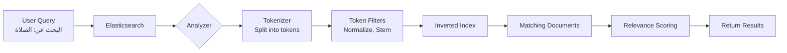
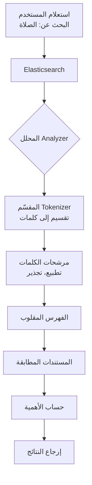

# 📖 How Elasticsearch Works - Complete Guide
# كيف يعمل Elasticsearch - دليل شامل

---

## 🌐 English Section

### What is Elasticsearch?

**Elasticsearch** is a distributed, RESTful search and analytics engine capable of solving a growing number of use cases. It is the heart of the Elastic Stack and centrally stores your data for lightning fast search, fine‑tuned relevancy, and powerful analytics that scale with ease.

### Core Concepts

#### 1. Documents

A **document** is a basic unit of information that can be indexed. In our case, each page from a book is a document.

```json
{
  "id": 12345,
  "content": "هذا نص من صفحة في كتاب فقهي",
  "page_number": 42,
  "book_id": 123,
  "book_title": "المجموع شرح المهذب",
  "author_names": "الإمام النووي"
}
```

#### 2. Index

An **index** is a collection of documents that have somewhat similar characteristics. Think of it as a database.

| Concept | Elasticsearch | Traditional Database |
|---------|--------------|---------------------|
| Database | Cluster | Database Server |
| Table | Index | Table |
| Row | Document | Row |
| Column | Field | Column |

#### 3. Shards and Replicas

- **Shard**: A single Lucene index. An index can be divided into multiple shards.
- **Replica**: A copy of a shard for high availability.

```
Index: pages_new_search
├── Primary Shard 0 ─── Replica 0
├── Primary Shard 1 ─── Replica 1
└── Primary Shard 2 ─── Replica 2
```

### How Search Works



### The Inverted Index

This is the secret behind Elasticsearch's speed. Instead of searching through every document, it maintains an index of all unique terms.

**Traditional Search:**
```
Document 1: "الصلاة فريضة"
Document 2: "كتاب الصلاة"
Document 3: "أحكام الصوم"

To find "الصلاة" → Scan ALL documents
```

**Inverted Index:**
```
Term       → Document IDs
الصلاة     → [1, 2]
فريضة      → [1]
كتاب       → [2]
أحكام      → [3]
الصوم      → [3]

To find "الصلاة" → Instant lookup! → [1, 2]
```

### Analyzers for Arabic Text

Elasticsearch uses **analyzers** to process text during indexing and searching.

#### Components of an Analyzer:

1. **Character Filters**: Transform text before tokenization
2. **Tokenizer**: Splits text into tokens (words)
3. **Token Filters**: Transform tokens (lowercase, stems, etc.)

#### Three Arabic Analyzers:

```
┌──────────────────────────────────────────────────────────────┐
│                     1. Arabic Exact                          │
│          "الصلاة" → ["الصلاة"]                              │
│          No modification - exact matching                    │
└──────────────────────────────────────────────────────────────┘

┌──────────────────────────────────────────────────────────────┐
│                     2. Arabic Flexible                        │
│          "الصلاة" → ["صلاه"]                                 │
│          Removes: ال، أ→ا، ة→ه (normalization only)          │
└──────────────────────────────────────────────────────────────┘

┌──────────────────────────────────────────────────────────────┐
│                     3. Arabic Stemmed                         │
│          "الصلاة" → ["صل"]                                   │
│          Extracts root (جذر) - finds صلى، يصلي، صلوات        │
└──────────────────────────────────────────────────────────────┘
```

### Query Types

#### 1. Match Query
Finds documents containing the query terms.

```json
{
  "query": {
    "match": {
      "content": "الصلاة الفجر"
    }
  }
}
```

#### 2. Match Phrase Query
Finds documents with exact phrase.

```json
{
  "query": {
    "match_phrase": {
      "content": "صلاة الفجر"
    }
  }
}
```

#### 3. Bool Query
Combines multiple conditions.

```json
{
  "query": {
    "bool": {
      "must": [
        { "match": { "content": "الصلاة" } }
      ],
      "filter": [
        { "term": { "book_section_id": 5 } }
      ]
    }
  }
}
```

### Relevance Scoring

Elasticsearch calculates a **_score** for each document based on:

1. **TF (Term Frequency)**: How often does the term appear in the document?
2. **IDF (Inverse Document Frequency)**: How rare is the term across all documents?
3. **Field Length**: Shorter fields get higher scores

```
Score = TF × IDF × Field Boost
```

---

## 🌍 القسم العربي

### ما هو Elasticsearch؟

**Elasticsearch** هو محرك بحث وتحليلات موزع، قادر على حل عدد متزايد من حالات الاستخدام. يخزن بياناتك مركزياً للحصول على بحث سريع جداً، صلة دقيقة، وتحليلات قوية تتوسع بسهولة.

### المفاهيم الأساسية

#### 1. المستندات (Documents)

**المستند** هو وحدة المعلومات الأساسية التي يمكن فهرستها. في حالتنا، كل صفحة من كتاب هي مستند.

```json
{
  "id": 12345,
  "content": "هذا نص من صفحة في كتاب فقهي",
  "page_number": 42,
  "book_id": 123,
  "book_title": "المجموع شرح المهذب",
  "author_names": "الإمام النووي"
}
```

#### 2. الفهرس (Index)

**الفهرس** هو مجموعة من المستندات التي لها خصائص متشابهة. فكر فيه كقاعدة بيانات.

| المفهوم | Elasticsearch | قاعدة البيانات التقليدية |
|---------|--------------|-------------------------|
| قاعدة البيانات | Cluster | خادم قاعدة البيانات |
| الجدول | Index | الجدول |
| الصف | Document | الصف |
| العمود | Field | العمود |

#### 3. الـ Shards والنسخ

- **Shard**: فهرس Lucene مفرد. يمكن تقسيم الفهرس إلى عدة shards.
- **Replica**: نسخة من الـ shard للتوافر العالي.

### كيف يعمل البحث



### الفهرس المقلوب (Inverted Index)

هذا هو السر وراء سرعة Elasticsearch. بدلاً من البحث في كل مستند، يحتفظ بفهرس لجميع المصطلحات الفريدة.

**البحث التقليدي:**
```
المستند 1: "الصلاة فريضة"
المستند 2: "كتاب الصلاة"
المستند 3: "أحكام الصوم"

للبحث عن "الصلاة" ← مسح جميع المستندات
```

**الفهرس المقلوب:**
```
المصطلح    ← أرقام المستندات
الصلاة     ← [1, 2]
فريضة      ← [1]
كتاب       ← [2]
أحكام      ← [3]
الصوم      ← [3]

للبحث عن "الصلاة" ← بحث فوري! ← [1, 2]
```

### المحللات للنص العربي

يستخدم Elasticsearch **المحللات (Analyzers)** لمعالجة النص أثناء الفهرسة والبحث.

#### مكونات المحلل:

1. **مرشحات الأحرف (Character Filters)**: تحويل النص قبل التقسيم
2. **المقسّم (Tokenizer)**: تقسيم النص إلى كلمات
3. **مرشحات الكلمات (Token Filters)**: تحويل الكلمات (تصغير، تجذير، إلخ)

#### ثلاثة محللات عربية:

```
┌──────────────────────────────────────────────────────────────┐
│                 1. البحث المطابق (Exact)                      │
│          "الصلاة" ← ["الصلاة"]                               │
│          بدون تعديل - مطابقة حرفية                           │
│          يجد: "الصلاة" فقط                                   │
└──────────────────────────────────────────────────────────────┘

┌──────────────────────────────────────────────────────────────┐
│                 2. البحث المرن (Flexible)                     │
│          "الصلاة" ← ["صلاه"]                                 │
│          يزيل: ال، أ→ا، ة→ه (تطبيع فقط)                      │
│          يجد: "صلاة"، "الصلاة"، "بالصلاة"، "والصلاة"          │
└──────────────────────────────────────────────────────────────┘

┌──────────────────────────────────────────────────────────────┐
│                 3. البحث الصرفي (Morphological)               │
│          "الصلاة" ← ["صل"]                                   │
│          يستخرج الجذر (ص-ل-ي)                                │
│          يجد: "صلى"، "يصلي"، "صلوات"، "مصلٍ"، "صلاة"          │
└──────────────────────────────────────────────────────────────┘
```

### أنواع الاستعلامات

#### 1. استعلام المطابقة (Match Query)
يجد المستندات التي تحتوي على مصطلحات البحث.

```json
{
  "query": {
    "match": {
      "content": "الصلاة الفجر"
    }
  }
}
```

#### 2. استعلام مطابقة العبارة (Match Phrase Query)
يجد المستندات مع العبارة بالضبط.

```json
{
  "query": {
    "match_phrase": {
      "content": "صلاة الفجر"
    }
  }
}
```

#### 3. الاستعلام المنطقي (Bool Query)
يجمع عدة شروط.

```json
{
  "query": {
    "bool": {
      "must": [
        { "match": { "content": "الصلاة" } }
      ],
      "filter": [
        { "term": { "book_section_id": 5 } }
      ]
    }
  }
}
```

### حساب الأهمية (Relevance Scoring)

يحسب Elasticsearch **درجة (_score)** لكل مستند بناءً على:

1. **TF (تكرار المصطلح)**: كم مرة يظهر المصطلح في المستند؟
2. **IDF (التكرار العكسي)**: ما مدى ندرة المصطلح في جميع المستندات؟
3. **طول الحقل**: الحقول الأقصر تحصل على درجات أعلى

```
الدرجة = TF × IDF × معامل التعزيز
```

---

## 📚 Key Terminology / المصطلحات الرئيسية

| English | العربية | Description |
|---------|---------|-------------|
| Index | فهرس | Collection of documents |
| Document | مستند | Single searchable item |
| Field | حقل | Attribute of a document |
| Analyzer | محلل | Text processor |
| Tokenizer | مقسّم | Splits text into words |
| Query | استعلام | Search request |
| Score | درجة | Relevance ranking |
| Shard | جزء | Subdivision of index |
| Replica | نسخة | Copy of shard |
| Mapping | خريطة | Schema definition |

---

## 🔗 Related Files

- [Elasticsearch Health Check](file:///c:/Users/osaidsalah002/Documents/BMS_alkamelah/docs/ELASTICSEARCH_HEALTH_CHECK.md)
- [Elasticsearch in This Project](file:///c:/Users/osaidsalah002/Documents/BMS_alkamelah/docs/ELASTICSEARCH_IN_PROJECT.md)
